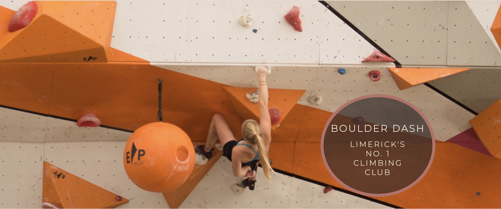
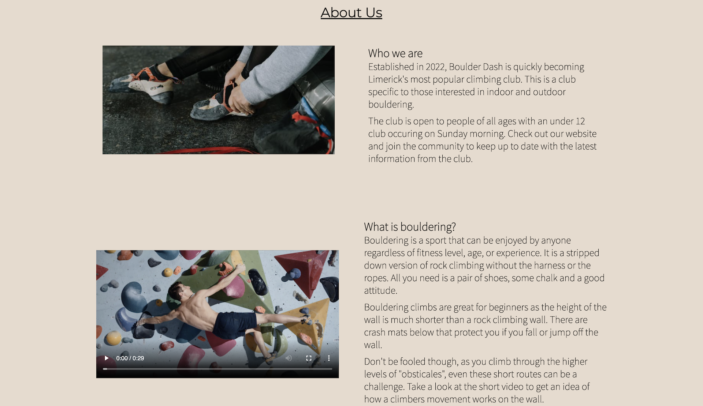
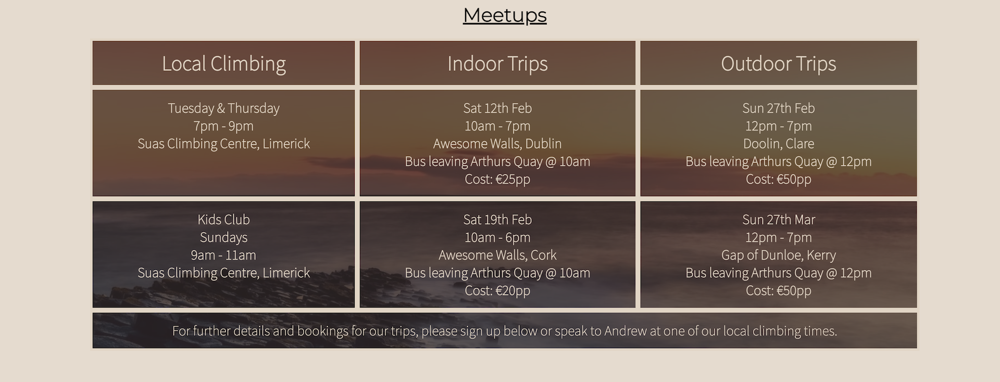
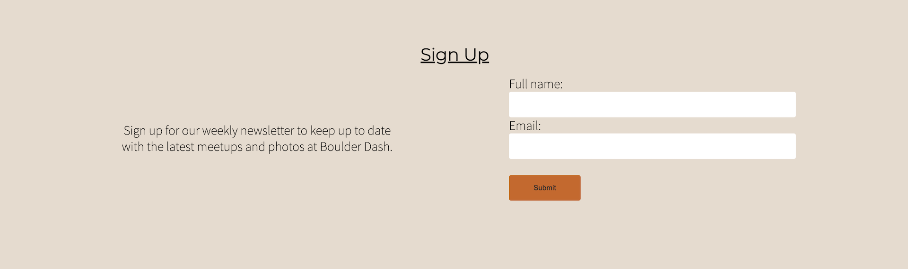

# Boulder Dash

Boulder dash is a site that hopes to create a connection between other climbers by creating regular meetups and trips around Ireland. Bouldering is a specfic style of rock climbing that is simplified by requiring very little equipment. The site targets climbers that are interested in bouldering but also encourages those that are new to the idea to join. The sport can be considered a solo sport but the site aims to bring people together of all skill levels to teach and learn from each other both indoors and also have the chance to experience what climbing is like in an outdoor enviornment, something that is not so easy to achieve on your own.

## Features 

There was an focus on keeping this site as simple as possible to have it accessible to as many users as possible. The site is a 3 page scrolling website with a main navigation bar and logo, a hero image, an about us section, a meetups section, a sign up section and social media links in the footer.

### Existing Features

- __Navigation Bar__

  - Featured at the top of the website, the navigation bar features a boulder dash logo linking to the index.html home page, and links to the various sections in the site: About us, Meetups and Sign up sections.
  - This section allows users to quicky move to the desired area of the website.

- __The Hero image__

  - Below the nav bar the site opens to a large image of a climber ascending a bouldering obstacle. The text overlay tells the user what the site name is and what it's purpose is
  - The image was chosen that had an attractive color scheme. Colors were then taken from the image to style the rest of the website creating continuity between the first experience of seeing the site to the end when the user can sign up.
  - The image and cover text are animated allowing the image to appear first then finally drawing the users attention to the cover text.

- __About Us Section__

  - The about us section is broken into two parts. The first part diplays an image of a pair of climbing shoes with a paragraph explaining in more detail the purpose of the website.
  - The second part poses a question "What is bouldering?" and provides the user with a detailed answer and a video showing a climber ascending a bouldering obstacle.

- __Meetup Times section__

  - Broken into 3 main titles, a grid displays meetup times for the club and the different national trips that are coming up. 
  - This section will be updated as these times change to keep the user up to date. 

- __Sign Up section__

  - This section allows the users to sign up to the website. The intention is to provide the user with an account and a place easy to book in for trips while recieving a newsletter regarding upcoming events. The user must enter their full name and an email address.

- __The Footer__ 

  - The footer contains links to the clubs social media pages. The links open on a new tab to provide alternative means of contacting the club and anyone involved.

### Features Left to Implement

- In the future creating either a fixed nav bar or a button to bring the user back to the top of the site could help with quicker site navigation.

## Testing 

**!!!!!!COMPLETE THIS SECTION!!!!!**

In this section, you need to convince the assessor that you have conducted enough testing to legitimately believe that the site works well. Essentially, in this part you will want to go over all of your project’s features and ensure that they all work as intended, with the project providing an easy and straightforward way for the users to achieve their goals.

In addition, you should mention in this section how your project looks and works on different browsers and screen sizes.

You should also mention in this section any interesting bugs or problems you discovered during your testing, even if you haven't addressed them yet.

If this section grows too long, you may want to split it off into a separate file and link to it from here.

### Validator Testing 

**!!!!!!COMPLETE THIS SECTION!!!!!**
- HTML
  - No errors were returned when passing through the official [W3C validator](https://validator.w3.org/nu/?doc=https%3A%2F%2Fajraf101.github.io%2Fboulder_dash%2Findex.html)
- CSS
  - No errors were found when passing through the official [(Jigsaw) validator](https://jigsaw.w3.org/css-validator/validator?uri=https%3A%2F%2Fajraf101.github.io%2Fboulder_dash%2F&profile=css3svg&usermedium=all&warning=1&vextwarning=&lang=en)

### Unfixed Bugs

You will need to mention unfixed bugs and why they were not fixed. This section should include shortcomings of the frameworks or technologies used. Although time can be a big variable to consider, paucity of time and difficulty understanding implementation is not a valid reason to leave bugs unfixed. 

## Deployment

This section should describe the process you went through to deploy the project to a hosting platform (e.g. GitHub) 

- The site was deployed to GitHub pages. The steps to deploy are as follows: 
  - In the GitHub repository, navigate to the Settings tab 
  - From the source section drop-down menu, select the Master Branch
  - Once the master branch has been selected, the page will be automatically refreshed with a detailed ribbon display to indicate the successful deployment. 

The live link can be found here - https://code-institute-org.github.io/love-running-2.0/index.html 

## Credits 

In this section you need to reference where you got your content, media and extra help from. It is common practice to use code from other repositories and tutorials, however, it is important to be very specific about these sources to avoid plagiarism. 

You can break the credits section up into Content and Media, depending on what you have included in your project. 

### Content 

- The text for the Home page was taken from Wikipedia Article A
- Instructions on how to implement form validation on the Sign Up page was taken from [Specific YouTube Tutorial](https://www.youtube.com/)
- The icons in the footer were taken from [Font Awesome](https://fontawesome.com/)

### Media

- The photos used on the home and sign up page are from This Open Source site
- The images used for the gallery page were taken from this other open source site

Congratulations on completing your Readme, you have made another big stride in the direction of being a developer! 

## Other General Project Advice

Below you will find a couple of extra tips that may be helpful when completing your project. Remember that each of these projects will become part of your final portfolio so it’s important to allow enough time to showcase your best work! 

- One of the most basic elements of keeping a healthy commit history is with the commit message. When getting started with your project, read through [this article](https://chris.beams.io/posts/git-commit/) by Chris Beams on How to Write  a Git Commit Message 
  - Make sure to keep the messages in the imperative mood 

- When naming the files in your project directory, make sure to consider meaningful naming of files, point to specific names and sections of content.
  - For example, instead of naming an image used ‘image1.png’ consider naming it ‘landing_page_img.png’. This will ensure that there are clear file paths kept. 

- Do some extra research on good and bad coding practices, there are a handful of useful articles to read, consider reviewing the following list when getting started:
  - [Writing Your Best Code](https://learn.shayhowe.com/html-css/writing-your-best-code/)
  - [HTML & CSS Coding Best Practices](https://medium.com/@inceptiondj.info/html-css-coding-best-practice-fadb9870a00f)
  - [Google HTML/CSS Style Guide](https://google.github.io/styleguide/htmlcssguide.html#General)

Getting started with your Portfolio Projects can be daunting, planning your project can make it a lot easier to tackle, take small steps to reach the final outcome and enjoy the process! 
