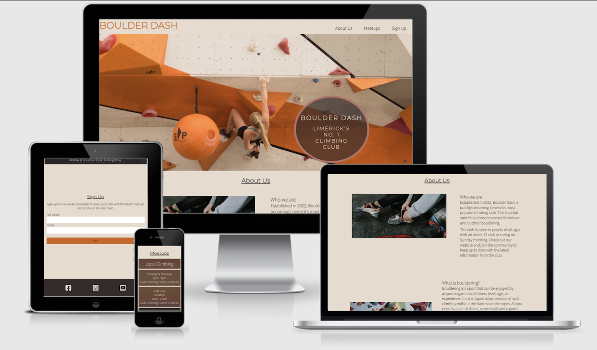

# Boulder Dash

Boulder dash is a site that hopes to create a connection between other climbers by creating regular meetups and trips around Ireland. Bouldering is a specfic style of rock climbing that is simplified by requiring very little equipment. The site targets climbers that are interested in bouldering but also encourages those that are new to the idea to join. The sport can be considered a solo sport. The site aims to bring people together of all skill levels to teach and learn from each other. It encourages both indoors and the chance to experience what climbing is like in an outdoor enviornment.

## Features 

There was an focus on keeping this site as simple as possible to have it accessible to as many users as possible. The site is a 3 page scrolling website with a main navigation bar and logo, a hero image, an about us section, a meetups section, a sign up section and social media links in the footer.

### Existing Features

- __Navigation Bar__

  - Featured at the top of the website, the navigation bar features a boulder dash logo linking to the index.html home page, and links to the various sections in the site: About us, Meetups and Sign up sections.
  - This section allows users to quicky move to the desired area of the website.

- __The Hero image__

  - Below the nav bar the site opens to a large image of a climber ascending a bouldering obstacle. The text overlay tells the user what the site name is and what it's purpose is
  - The image was chosen that had an attractive color scheme. Colors were then taken from the image to style the rest of the website creating continuity between the first experience of seeing the site to the end when the user can sign up.
  - The image and cover text are animated allowing the image to appear first then finally drawing the users attention to the cover text.

- __About Us Section__

  - The about us section is broken into two parts. The first part diplays an image of a pair of climbing shoes with a paragraph explaining in more detail the purpose of the website.
  - The second part poses a question "What is bouldering?" and provides the user with a detailed answer and a video showing a climber ascending a bouldering obstacle.

- __Meetup Times section__

  - Broken into 3 main titles, a grid displays meetup times for the club and the different national trips that are coming up. 
  - This section will be updated as these times change to keep the user up to date. 

- __Sign Up section__

  - This section allows the users to sign up to the website. The intention is to provide the user with an account and a place easy to book in for trips while recieving a newsletter regarding upcoming events. The user must enter their full name and an email address.

- __The Footer__ 

  - The footer contains links to the clubs social media pages. The links open on a new tab to provide alternative means of contacting the club and anyone involved.

### Features Left to Implement

- In the future creating either a fixed nav bar or a button to bring the user back to the top of the site could help with quicker site navigation.

## Testing 

**!!!!!!COMPLETE THIS SECTION!!!!!**

Testing has been carried out regularily throughtout the development of this website. As changes were made they were checked using the gitpod external server where the current and most up to date website would be displayed. The site was tested on multiple devices including a 13" Macbook pro, and ipad air 2 and an iphone xs. Various browsers were used in the testing phases. These included chrome, safari and firefox. 

Interactive features were tested on each device to ensure the worked on all platforms. The main logo would reload the index.html page when pressed and each nav bar button brings the user to the correct section of the site.

The video was tested on each device with the controls also confirmed to be working. The sign up form has also been tested and ensured that the link opens to a new tab. The social media icons follow the same idea with each opening to a new tab.

The website had further testing carried out by other users. The link was sent to a list of uses to test on the devices that they were using. All reports came back without any issues.

### Validator Testing 

- HTML
  - No errors were returned when passing through the official [W3C validator](https://validator.w3.org/nu/?doc=https%3A%2F%2Fajraf101.github.io%2Fboulder_dash%2Findex.html)
- CSS
  - No errors were found when passing through the official [(Jigsaw) validator](https://jigsaw.w3.org/css-validator/validator?uri=https%3A%2F%2Fajraf101.github.io%2Fboulder_dash%2F&profile=css3svg&usermedium=all&warning=1&vextwarning=&lang=en)

## Deployment

- The site was deployed to GitHub pages. The steps to deploy are as follows: 
  - In the GitHub repository, navigate to the Settings tab 
  - in the code automation section on the left choose the pages tab.
  - From the source section drop-down menu, select the Main Branch
  - Once the main branch has been selected, the page will be automatically refreshed with a detailed ribbon display to indicate the successful deployment. 

The live link can be found here - https://ajraf101.github.io/boulder_dash/

## Credits 

There were a large list of resources used in the creation of this site. Some of the most popular included https://stackoverflow.com/, tutors/students from code institute on slack and w3schools. Below are a list of the resources that have been used in the development of this site. All images and videos were provided by https://www.pexels.com/.

Favicon tutorial: https://www.w3schools.com/html/html_favicon.asp

Hero image location https://www.pexels.com/photo/sport-muscles-climbing-climber-9606/

Meetups grid: https://www.w3schools.com/css/css_grid.asp

Meetups grid photo: https://www.pexels.com/photo/beach-clouds-dawn-dusk-533842/

Signup flexbox: https://coder-coder.com/display-divs-side-by-side/

About us photo: https://www.pexels.com/photo/road-fashion-man-people-6676719/

Linking nav bar to areas on the site: https://www.tutorialrepublic.com/html-tutorial/html-links.php#:~:text=HTML 

Styling with font awesome: https://fontawesome.com/docs/web/style/styling

Vertically align inside a flex box https://stackoverflow.com/questions/25311541/how-to-vertically-align-text-inside-a-flexbox

How the grid worked in the end:https://www.w3schools.com/css/css_grid.asp

Grid background: https://www.w3schools.com/cssref/css3_pr_background-size.asp

Styling for video in a div: Width: https://css-tricks.com/fluid-width-video/ Vertical align:https://stackoverflow.com/questions/28634780/vertically-centering-video-inside-a-video-tag

Styling a paragraph:https://stackoverflow.com/questions/41253908/changing-spacing-between-paragraphs-and-inside-of-paragraphs, https://blog.hubspot.com/website/how-to-indent-css#:~:text=Paragraphs

Video compressor:https://www.veed.io/video-compressor

Image color picker: https://imagecolorpicker.com/en
Color pallette based on hero image 
#9e410c maroon 
#c0a68e dark beige 
#d06418 rich orange 
#e7dbce Cream 
#e4d4c3 slightly darker cream 
#352b2c dark brown/off-grey 
#d8854f pastel orange 
#7a624d light brown/green 
#b87067 pastel pink/red

